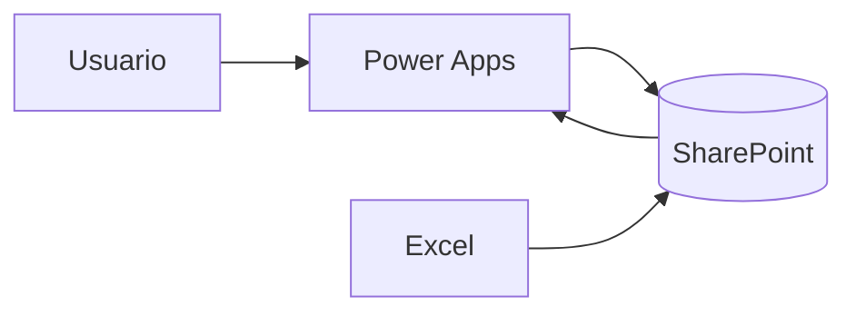

# Gestión de protocolos — TFG

Aplicación desarrollada originalmente con **Power Apps**, **SharePoint** y **Excel** para centralizar protocolos, mostrar a cada usuario los documentos correspondientes a su servicio y categoría, conservar la versión vigente y registrar su lectura.

Este repositorio contiene una **reconstrucción demostrativa** con datos sintéticos. Permite entender y probar el flujo sin conectarse al entorno institucional ni publicar la exportación original.

**[Abrir la demo interactiva](https://sebigithub.github.io/projects/tfg/)**

## Qué problema resuelve

Cuando los documentos están repartidos entre carpetas y versiones, localizar el protocolo aplicable puede requerir búsquedas manuales. La solución organiza un catálogo y utiliza el perfil del usuario para decidir qué documentos mostrar.

## Funcionalidades demostradas

- Selección de un perfil ficticio.
- Filtrado por servicio y categoría profesional.
- Exclusión de borradores no publicados.
- Búsqueda por título y descripción.
- Visualización de la versión vigente.
- Registro local de la lectura con usuario, versión y fecha.
- Datos preparados en Excel para crear las listas de SharePoint.

## Probar la demo web

1. Descarga o clona el repositorio.
2. Abre `demo/index.html` en un navegador.
3. Cambia entre Ana, Bruno y Carla para comprobar el filtrado.
4. Busca un protocolo y pulsa **Registrar lectura**.
5. Usa **Reiniciar demo** para recuperar el estado inicial.

La demo guarda las nuevas lecturas en `localStorage` del navegador. No envía información a ningún servidor.

## Montaje en Power Apps y SharePoint

El libro [`sample-data/datos-demo.xlsx`](sample-data/datos-demo.xlsx) contiene seis hojas:

- `Guia`
- `Usuarios`
- `Servicios`
- `Categorias`
- `Protocolos`
- `Lecturas`

La guía [`docs/INSTALACION.md`](docs/INSTALACION.md) explica cómo crear las cinco listas de SharePoint, conectarlas a una aplicación de lienzo y configurar las fórmulas de perfil, catálogo y registro de lectura.

Consulta [`docs/ARQUITECTURA-Y-DATOS.md`](docs/ARQUITECTURA-Y-DATOS.md) para ver el flujo y las relaciones del modelo.

## Arquitectura



Excel prepara los datos de entrada. SharePoint actúa como origen persistente. Power Apps aplica el flujo de consulta y registro. En un entorno real, SharePoint debe aplicar los permisos efectivos; ocultar registros en la interfaz no sustituye la autorización del origen.

## Estructura del repositorio

```text
demo/                  Demo web ejecutable
docs/                  Arquitectura e instalación
sample-data/           Libro Excel con datos ficticios
examples/              Fixture sintético mínimo
.github/workflows/     Control contra publicaciones accidentales
```

## Alcance

La demo reproduce el comportamiento principal descrito en el TFG, pero no es la exportación original de Power Apps. No incluye conexiones, identificadores, datos de trabajadores, documentos clínicos ni recursos institucionales.

Todos los nombres, servicios, perfiles, documentos, correos y lecturas son inventados. Los correos y enlaces utilizan el dominio reservado `example.invalid`.

## Seguridad

Antes de añadir una exportación de Power Apps, una captura o un nuevo conjunto de datos, revisa conexiones, metadatos, propiedades y contenido en privado. El workflow limita los archivos permitidos, verifica el Excel de demostración y busca patrones básicos de datos personales. Más información en [`SECURITY.md`](SECURITY.md).
