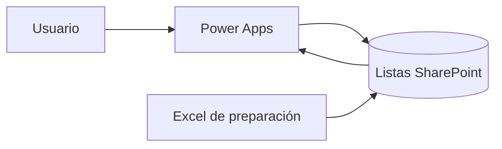

# Arquitectura y datos de demostración

## Flujo original

Excel se utilizó para preparar y revisar registros antes de incorporarlos a SharePoint. Power Apps consultaba las listas y mostraba el catálogo correspondiente al perfil. En producción, los permisos deben aplicarse en SharePoint; filtrar u ocultar elementos en la interfaz no constituye un control de acceso suficiente.

## Modelo reproducible

| Lista | Clave | Relación o finalidad |
| --- | --- | --- |
| UsuariosDemo | CorreoTexto | Asocia un usuario con ServicioCodigo y CategoriaCodigo. |
| ServiciosDemo | Codigo | Catálogo de servicios ficticios. |
| CategoriasDemo | Codigo | Catálogo de categorías ficticias. |
| ProtocolosDemo | Codigo | Define versión, estado y alcance por servicio/categoría. |
| LecturasDemo | Codigo | Registra usuario, protocolo, versión y fecha de lectura. |

Todos los identificadores son texto para facilitar la importación. Los correos usan `example.invalid`, dominio reservado para documentación. Las URL de documentos también apuntan a `example.invalid`.
